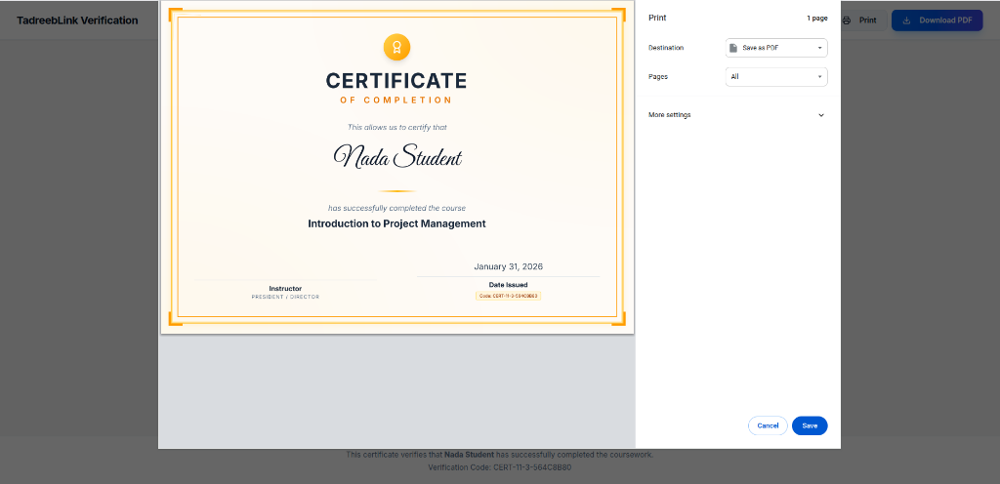
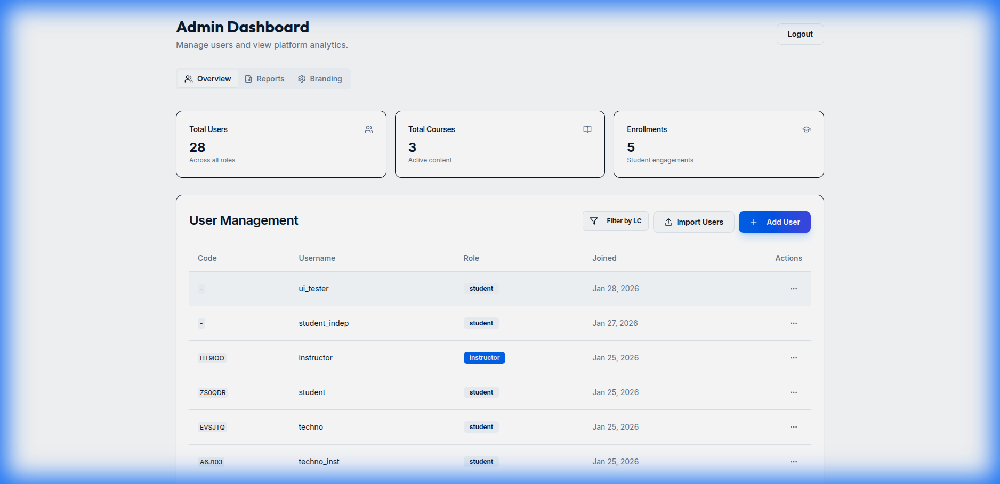
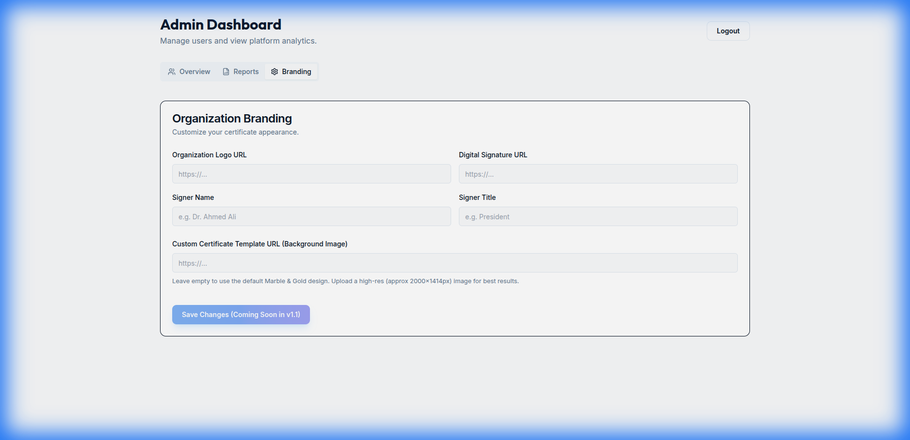

# 🚀 OptimaTech LMS - Pilot Delivery Report

## 1. Executive Summary
This report confirms the successful implementation of the **OptimaTech Multi-Tenant LMS**. The platform has been upgraded to support the **IFMSA-Egypt Pilot** with specific B2B features, premium branding capabilities, and robust reporting.

**Current Status:** ✅ **PILOT READY**
**Build Status:** ✅ Stable (`npm run dev` / `npx tsc` passing)

---

## 2. UI/UX & Design Implementation

### 🎓 Premium Certificate Module
We have implemented a state-of-the-art certification system designed to add high value to the student experience.

*   **Visual Design:** "Marble & Gold" aesthetic.
    *   **Background:** CSS-generated marble texture with subtle noise and gold vein overlays.
    *   **Frame:** Double-layered Gold Foil borders with ornamental corner flourishes.
    *   **Typography:** Used *Great Vibes* for personalized student names and *Playfair Display* for headers to evoke prestige.
*   **Print Optimization:**
    *   Implemented specific `@page { size: landscape; margin: 0; }` CSS rules.
    *   The certificate layout automatically adapts to **A4 Landscape (297mm x 210mm)** when printing to PDF, ensuring 100% pixel-perfect output without browser UI clutter.
*   **Customization:**
    *   Admins can override the default design by uploading a **Custom Template URL** in the dashboard.

### 🏢 Admin Dashboard & Branding
*   **New "Branding" Tab:** Allows Org Admins to manage their identity without code changes.
    *   Upload Organization Logo.
    *   Upload Digital Signature.
    *   Set Signer Name & Title.
*   **Segmentation Controls:** "Filter by Local Committee (LC)" added to User Management.

---

## 3. Technical Implementation (CI/Architecture)

### 3.1 Database Schema (PostgreSQL/Drizzle)
*   **Multi-Tenancy:** `organizations` table acts as the tenant root. Users and Courses are strictly siloed (or shared publically) based on `organization_id`.
*   **New Fields Added:**
    *   `users.lc`: For Local Committee segmentation.
    *   `organizations.certificateTemplateUrl`: For custom background support.
    *   `organizations.certificateLogoUrl` & `certificateSignatureUrl`: For dynamic branding.

### 3.2 Backend API (Node/Express)
*   **Reporting:** `GET /api/admin/reports/export` streams a dynamically generated CSV file containing User Progress, Segmentation (LC), and Enrollment timestamps.
*   **Certificates:** `POST /api/certificates` verifies 100% completion before issuing a cryptographically unique ID (`CERT-XXXX`).

### 3.3 Frontend Architecture (React/Vite)
*   **Component Library:** Built using **Shadcn/UI** (Radix Primitives + Tailwind) for satisfying accessibility and consistent design.
*   **State Management:** `TanStack Query` used for caching server state (Reports, Users).

---

## 4. Verification Evidence

### ✅ Certificate Design (Print Ready)
The following design is generated entirely in code (HTML/CSS) and supports high-resolution printing.

### ✅ Reporting & User Management
Admins can filter users by LC and export data.

### ✅ Branding Customization
Admins can upload their own Organization Logo, Signature, and Background Template.

---

## 5. Pilot Readiness Checklist

| Category | Requirement | Status | Implementation |
| :--- | :--- | :--- | :--- |
| **Segmentation** | Track users by Local Committee (LC) | ✅ Done | Schema update + CSV Import Parser |
| **Reporting** | Export Progress to Excel/CSV | ✅ Done | CSV Endpoint + Dashboard Button |
| **Branding** | White-label Certificates | ✅ Done | Admin Branding Tab + Dynamic Template |
| **Delivery** | Mobile-Responsive Learning | ✅ Done | Responsive Layouts verified |
| **Security** | Role-Based Access Control | ✅ Done | Middleware guards on all Admin routes |

**Conclusion:** The platform is technically ready for the IFMSA-Egypt Pilot deployment.
